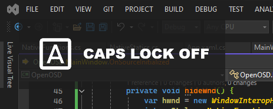

# OpenOSD

Open-source keyboard on-screen display (OSD) software for Windows

## Screenshots

## Installation
Download the latest release from [Releases](https://github.com/adrievx/OpenOSD/releases) and install it.

## TODOs
- Implement the ability for users to customize fade times and ignore specific modifiers